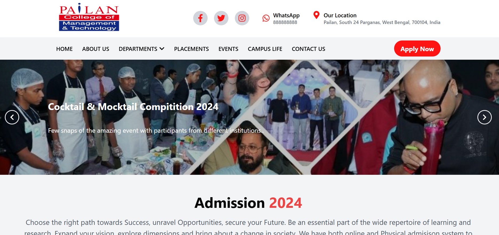
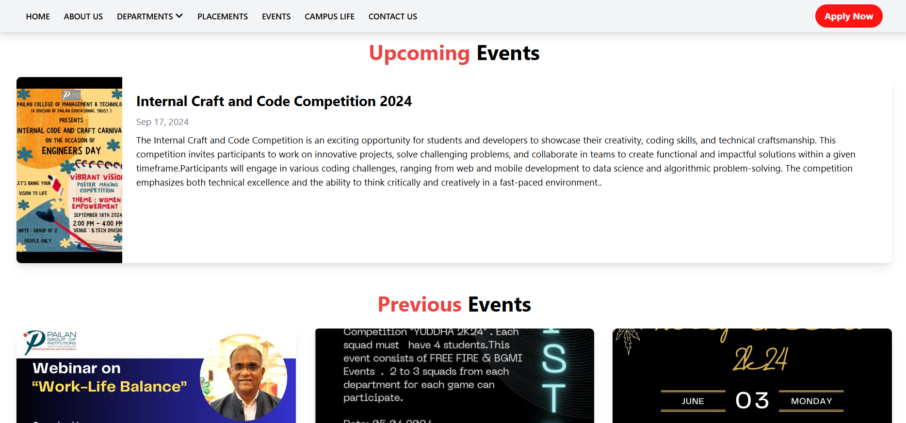
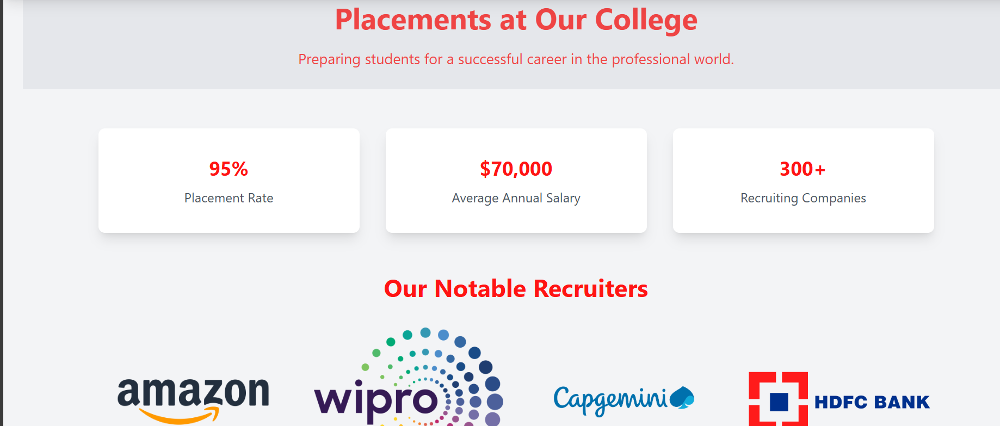
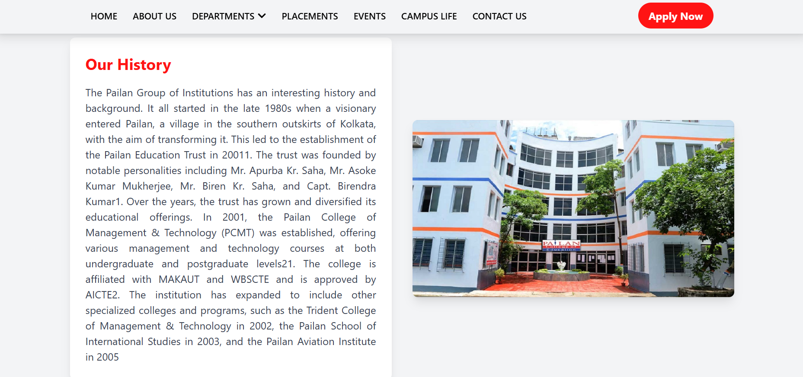
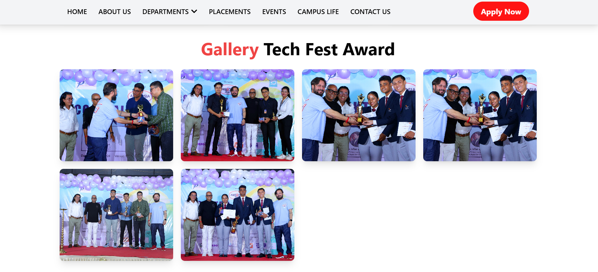
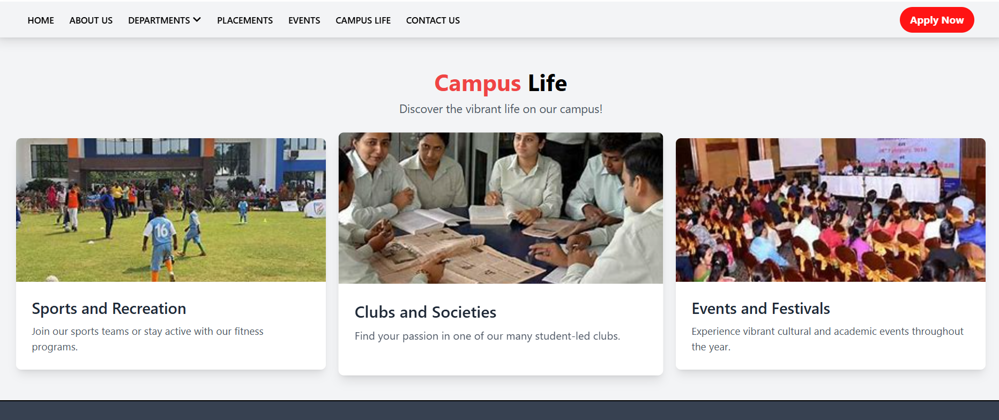
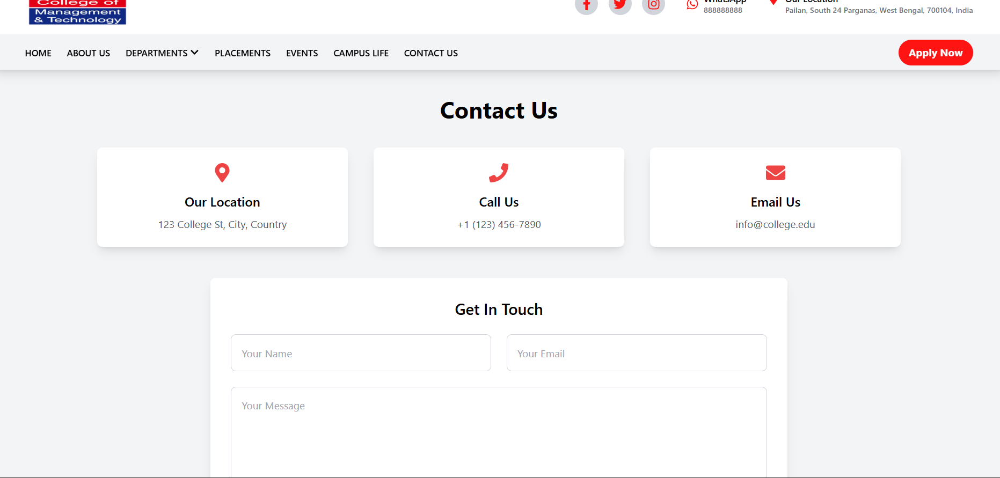

# 🎓 PCMT College Website (Frontend)


A **modern, responsive, and interactive college website** for **PCMT**  
Built with **React, Tailwind CSS, and Framer Motion** for smooth animations.

---

## 🚀 Live Demo  
🔗 [View Website](https://pcmt.vercel.app/)

---

## 📸 Screenshots  

### 🏠 Home Page  


### 📚 Courses Page  


### 🎉 Events Page  


### 💼 Placement Page  


### ℹ️ About Page  


### 🏆 Awards Page  


### 🏫 Campus Page  


### 📬 Contact Page  


---

## ✨ Features  
- 🖼️ **Framer Motion animations** for smooth transitions and interactive UI  
- 📚 **Courses showcase** with categories and filters  
- 🎉 **Events section** with highlights and details  
- 💼 **Placement updates** and company collaborations  
- 📝 **Online admission form** with validation  
- 📱 Fully **responsive design** for mobile, tablet, and desktop  
- 🌙 Optional **dark mode** toggle  
- 🔍 Search and quick navigation

---

## 🛠 Tech Stack  

**Frontend:** React, Tailwind CSS, Framer Motion  
**Deployment:** Vercel  

---

## 📦 Installation  

Follow these steps to run the project locally:

### 1️⃣ Clone the Repository  
```bash
git clone https://github.com/YourUsername/pcmt-college.git
cd pcmt-college
